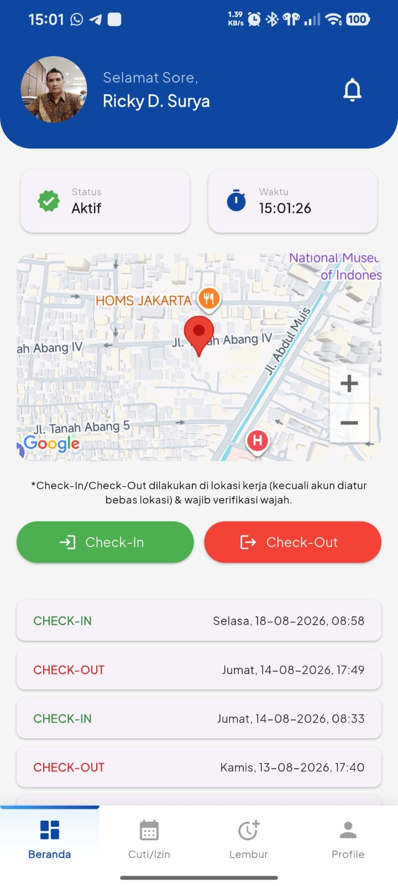
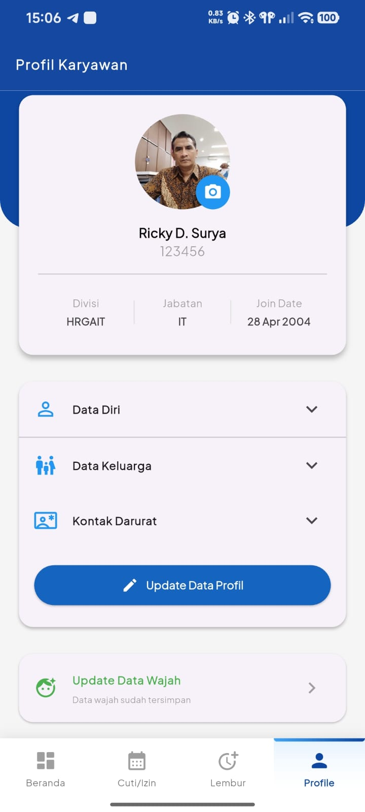

# Aplikasi Absensi Karyawan (Mobile & Dashboard)

Aplikasi absensi karyawan berbasis mobile (Flutter) dengan web admin dashboard, menggunakan Supabase sebagai backend.

**Status: Sudah selesai dikembangkan, dalam proses go-live.**

## Ringkasan

- **Nama internal**: `Absensi Tetra`
- **Platform**:
  - Mobile app karyawan - Flutter (Android/iOS)
  - Mobile app admin - Flutter (Android)
  - Web admin dashboard - Flutter Web, di-hosting via **Cloudflare Pages/Worker**
  - Firebase & Google Cloud Console
- **Backend**: Supabase (Auth, Database, Storage, RLS, Edge Function, Webhook)
- **CI/CD mobile**: Codemagic (`codemagic.yaml`)
- **Repo**: [rickyds-bot/hradmin-panel-tetra](https://github.com/rickyds-bot/hradmin-panel-tetra)

## Fitur Utama

- Register Karyawan konfirmasi by Email 
- Register Data Wajah kebutuhan Face Detection + Liveness
- Absen Check-in/Check-out dengan validasi **GPS + Foto Selfie**, dilengkapi **Face Detection**
- Absen Check-in/Check-out hanya bs dilakukan 1x (1 hari)
- Riwayat Absensi, Cuti/Izin & Lembur Karyawan
- Pengajuan Cuti/Izin & Lembur oleh Karyawan
- Approval pengajuan Cuti/Izin & Lembur oleh Atasan (Admin, Manager & Supervisor), berjenjang per **Divisi/Departemen**
- Karyawan bisa Export **PDF Laporan Lembur** langsung dari Aplikasi Mobile
- Form **Profil Karyawan**: Data Diri, Data Keluarga, dan Kontak Darurat
- Notifikasi:
  - Check-in/Check-out Absen → **Local Notification**
  - Pengajuan & Status Approval Cuti/Izin & Lembur → **Push Notification (FCM)**

- Dashboard Admin: Monitoring Absensi, Cuti/Izin & Lembur seluruh Karyawan
  - Manajemen Data Karyawan (Tambah/Edit/Aktif & Non-Aktif)
  - Approval Cuti/Izin & Lembur
  - Update Saldo Cuti
  - Form Input & Notifikasi Pemberitahun/Pengumuman
  - Sinkron dgn Kalendar Hari Libur/Tgl Merah IDN
  - Konfigurasi/Penambahan Lokasi Absensi dilakukan lewat **Admin Dashboard**
  - Set Titik/Radius Lokasi Absen (Multi lokasi)
  - Bisa mengaktifkan Mode **"Absen Bebas Lokasi"** (tanpa validasi GPS) per kebutuhan
  - Log Aktifitas Karyawan
- Laporan & Export:
  - Laporan Absensi, Cuti/Izin, dan Lembur → Export **XLSX & PDF** (dari Admin Dashboard)
  
## Preview 
<p align="center">   </p>

## Download Aplikasi

### Android (APK)
Download APK terbaru di halaman [Releases](https://github.com/rickyds-bot/hradmin-panel-tetra/releases/latest).

Atau klik langsung:
[](https://github.com/rickyds-bot/hradmin-panel-tetra/releases/latest/download/app-arm64-v8a-karyawan-release.apk)

### Cara Install
1. Download file `.apk` dari link di atas
2. Aktifkan "Install from Unknown Sources" di pengaturan HP Android
3. Buka file APK yang sudah diunduh, lalu install
4. Login menggunakan akun karyawan yang sudah teregister/terdaftar

### Web Admin Dashboard
Akses dashboard admin di: [https://hradmin-panel-tetra.prodigalx.workers.dev] 


## Struktur Project

```
lib/            # kode utama aplikasi Flutter (app Karyawan + Admin)
supabase/       # konfigurasi & migration database Supabase
web/            # build target web (Admin Dashboard)
android/ ios/   # konfigurasi Platform Mobile
codemagic.yaml  # konfigurasi CI/CD Build Mobile

```


## Menjalankan Secara Lokal

```bash
flutter clean
flutter pub get
flutter build apk --flavor karyawan -t lib/main_karyawan.dart --release --split-per-abi
flutter build apk --flavor admin -t lib/main_admin.dart --release --split-per-abi

```

Untuk target web (admin dashboard):
```bash
flutter run -d chrome -t lib/main_web.dart
flutter build web --target=lib/main_web.dart --release --no-wasm-dry-run

```

## Konfigurasi Supabase

Project ini membutuhkan environment/konfigurasi berikut :

- `SUPABASE_URL`
- `SUPABASE_ANON_KEY`


## Dokumentasi Terkait

- [`DEPLOYMENT.md`](./DEPLOYMENT.md) — panduan build & go-live
- [`CHANGELOG.md`](./CHANGELOG.md) 

## Lisensi

- Internal use — hak cipta © PT. Tetra Konstruksindo

## Kontak   

- Ricky D. Surya (ricky@tetra.co.id)
